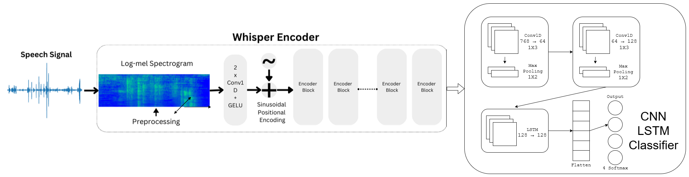
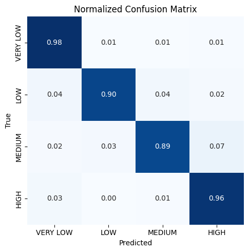
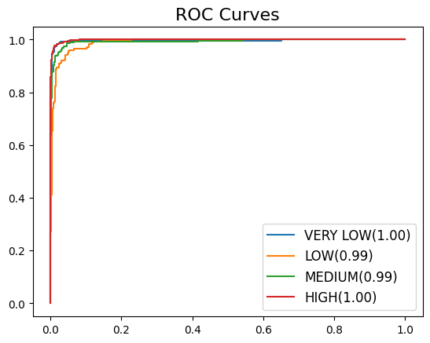
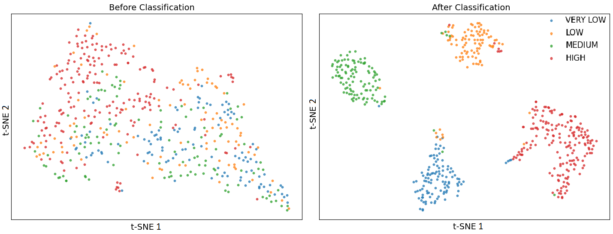

# 🧠 Dysarthria Severity Classification using Whisper, CNN, and LSTM

This project presents a deep learning framework that automatically classifies the severity of **Dysarthria**—a motor speech disorder—into four levels: **Very Low, Low, Medium, and High**, using speech recordings.

## 📌 Overview

Dysarthria results from neurological damage affecting the muscular control of speech. The aim of this project is to develop an automated, objective, and accurate dysarthria severity classification system that outperforms traditional manual evaluations.

We use a **hybrid deep learning architecture** combining:

* **Whisper Encoder**: For extracting robust speech embeddings
* **CNN**: For spatial feature extraction
* **LSTM**: For modeling temporal dependencies

---

## 🗂️ Dataset
* [Torgo](https://www.openai.com](https://www.cs.toronto.edu/~complingweb/data/TORGO/torgo.html "Visit The TORGO database")
* [UA-Speech](https://speechtechnology.web.illinois.edu/uaspeech/ "Access UA-Speech database")
* [Class-Data](https://www.kaggle.com/datasets/sochnedo/class-data "Class-Data made using Torgo and UA-Speech")

---

## 📊 Severity Labeling

Severity levels are annotated using speaker IDs from the **UA-Speech** and **TORGO** datasets:

| Severity | UA-Speech IDs           | TORGO IDs |
| -------- | ----------------------- | --------- |
| Very Low | F05, M08, M09, M10, M14 | F04, M03  |
| Low      | F04, M05, M11           | F01, M05  |
| Medium   | F02, M07, M16           | M01, M04  |
| High     | F03, M01, M04, M12      | -         |

---

## 🧠 Dysarthria Types (Reference)

| Type               | Localization                  |
| ------------------ | ----------------------------- |
| Flaccid            | Lower motor neuron            |
| Spastic            | Bilateral motor neuron        |
| Unilateral Spastic | Unilateral upper motor neuron |
| Ataxic             | Cerebellum                    |
| Hypokinetic        | Extrapyramidal                |
| Hyperkinetic       | Extrapyramidal                |
| Mixed              | Upper and lower motor neuron  |

---

## 🛠️ Architecture

1. **Input**: Raw audio → Log-mel spectrogram
2. **Whisper Encoder**: Extracts 80-dim latent embeddings
3. **CNN Layers**: Capture local spectral patterns
4. **LSTM Layer**: Captures long-term dependencies
5. **Classifier**: Outputs severity class via Softmax

---

## 🧪 Experimental Setup

* **Datasets**: UA-Speech, TORGO
* **Sampling Rate**: 44.1 kHz
* **Loss Function**: Categorical Cross-Entropy
* **Optimizer**: Adam (lr = 1e-4)
* **Epochs**: 50
* **Batch Size**: 32
* **Validation**: 5-fold stratified cross-validation

---

## 📈 Evaluation Metrics

* Accuracy
* Precision
* Recall (Sensitivity)
* Specificity
* F1-Score
* Cohen's Kappa (κ)

---

## 📊 Results

### ✅ Class-wise Accuracy

| Class    | Accuracy (%) |
| -------- | ------------ |
| Very Low | 98.67        |
| Low      | 89.39        |
| Medium   | 90.64        |
| High     | 95.52        |

### 🧪 Confusion Matrix

  

### 📊 ROC Curve

  

### 🎯 Feature Visualization (t-SNE)

  

---

## 🏆 Model Comparison

| Model                    | Accuracy | F1   | Precision | Sensitivity | Specificity | Kappa |
| ------------------------ | -------- | ---- | --------- | ----------- | ----------- | ----- |
| **Whisper + CNN + LSTM** | **0.94** | 0.94 | 0.94      | 0.94        | 0.94        | 0.91  |
| MFCC + EmoFormer         | 0.94     | 0.94 | 0.94      | 0.94        | 0.98        | 0.93  |
| CFCC + CNN               | 0.90     | 0.90 | 0.91      | 0.89        | 0.97        | 0.87  |

---

## 🔮 Future Work

* Multilingual dysarthria classification
* Noise robustness testing
* Integrating Wav2Vec2 or EmoFormer
* CQT and WST-based feature modeling
* Domain adaptation for cross-device deployment

---

## 📚 References

1. Avula et al., APSIPA ASC 2024
2. Hasan et al., EmoFormer, arXiv 2025
3. Joshy and Rajan, Speech Comm. 2023
4. Rathod et al., IEEE Sensors Lett. 2024
5. Mannepalli et al., Interspeech 2023
6. UA-Speech and TORGO datasets

---

## 👥 Team

* Himanshu
* Nitin Kumar Yadav
* Jay Gupta
* Yashan Garg

**Supervisor:** Dr. Karan Nathwani,
**Department of Electrical Engineering, IIT Jammu**

---
